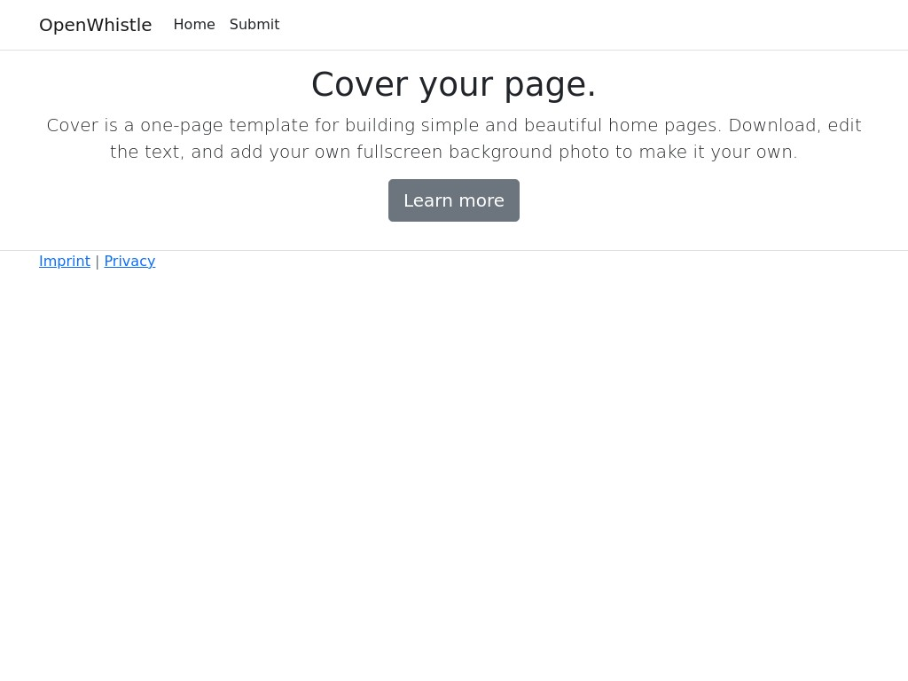

<div align="center">

# OpenWhistle <br> :bulb: :arrow_right: :ear:

> Open source tool for whistleblowers

[](https://github.com/jpylypiw/OpenWhistle/releases/)
[](https://github.com/jpylypiw/OpenWhistle/releases/?include_prereleases&sort=semver)
[](https://github.com/jpylypiw/OpenWhistle/blob/main/LICENSE)

[](https://github.com/jpylypiw/OpenWhistle/actions/workflows/dotnet.yml)
[](https://github.com/jpylypiw/OpenWhistle/actions/workflows/docker-publish.yml)
[](https://github.com/jpylypiw/OpenWhistle/actions/workflows/github-code-scanning/codeql)


[Installation](#how-to-install) — [Docker Environment](#environment-variables) — [Preview](#preview)

</div>

## Overview

> [!WARNING]  
> This project is currently under development and should not be used productively under any circumstances. 

This project is to become an open source software for the German Whistleblower Protection Act / Hinweisgeberschutzgesetz.

This law is based on the [directive of the European Parliament](https://eur-lex.europa.eu/legal-content/en/TXT/?uri=CELEX%3A32019L1937).

The aim of the software is initially to give an external whistleblower the opportunity to write a message to the reporting office.

The subsequent feedback to the whistleblower will be implemented at a later date.

A system must be created to ensure that the whistleblower remains anonymous at all times.

## Preview

<div align="center">
    
</div>

## Live Demo

To get a better insight into the software, we provide an online demo.

<https://demo.openwhistle.net> (Certificate is provided by Let's Encrypt)

- **Username**: demo
- **Password**: demo

The server runs in Baden-Württemberg, Germany.

The demo is currently reset manually and automatically receives the latest version of the software.

## How to Install

### Docker

We recommend using the Docker image for installation.

The image is provided by GitHub and can be started with the following command:

```bash
docker run -d --restart=always -e ASPNETCORE_HTTP_PORTS='4009' -p 4009:4009 --name openwhistle ghcr.io/jpylypiw/openwhistle:main
```

OpenWhistle is now running on <http://0.0.0.0:4009>.

### Behind Reverse Proxy

For privacy reasons, it is essential to configure the reverse proxy correctly.
Please note that the access log must be switched off so that the whistleblower remains anonymous.

#### NGINX

```nginx
location / {
    proxy_pass         http://localhost:4009/;
    access_log    off;
    log_not_found off;
}
```

## Environment Variables

## License

OpenWhistle is under [GNU General Public License v3.0](/LICENSE).
